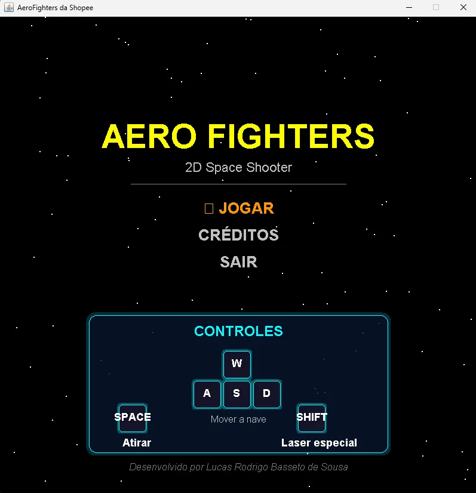
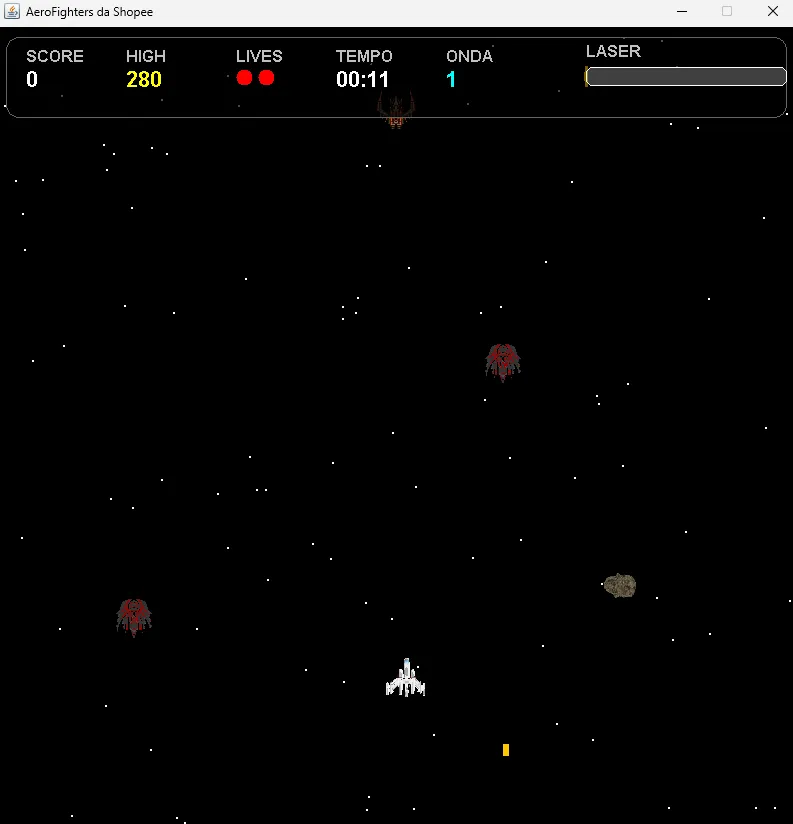
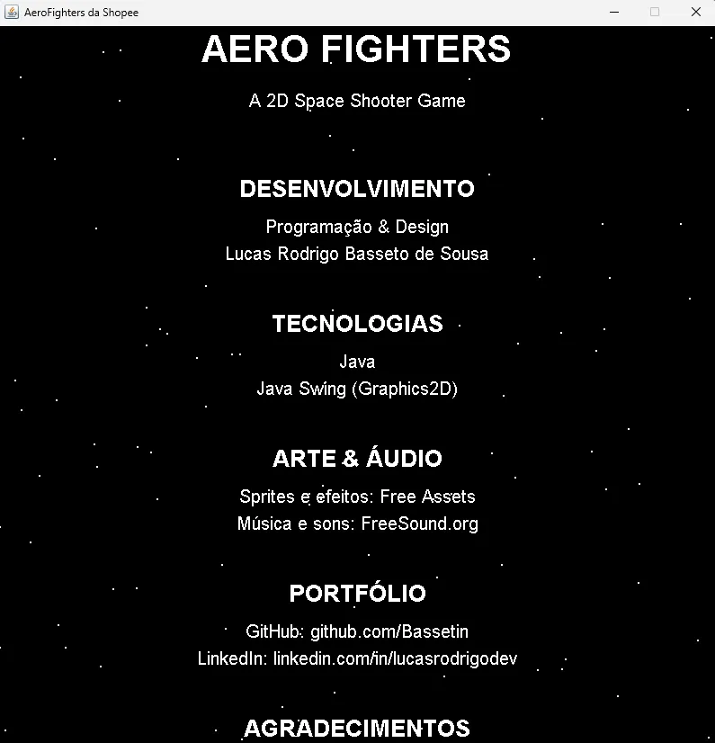

# 🚀 Aero Fighters — 2D Space Shooter

🎮 Projeto de jogo 2D desenvolvido do zero em Java, aplicando conceitos de Programação Orientada a Objetos, game loop, gerenciamento de estados e arquitetura de software.

Um jogo arcade shooter 2D desenvolvido do zero em **Java puro com Swing**, sem nenhuma game engine.


---

## 👨‍💻 Sobre o Projeto

Projeto desenvolvido individualmente, sendo responsável por toda a arquitetura, lógica de jogo, implementação de mecânicas, sistema de áudio e interface.

---

## 📸 Screenshots

| Screenshots |
|-------------|
|  |
|  |
|  |

---

## 🎮 Gameplay

> Sobreviva o maior tempo possível, destrua inimigos, enfrente bosses e colete power-ups!

- Ondas infinitas com dificuldade crescente
- Boss aparece a cada 5 ondas com 2 fases de comportamento
- Sistema de power-ups que dropam ao destruir asteroides
- Timer de sobrevivência e high score salvo em arquivo

---

## ✨ Funcionalidades

### Combate
- 🔫 **Tiro simples, duplo e triplo** (MultiShot progressivo)
- ⚡ **Laser especial** com barra de carga que recarrega automaticamente
- 🛡️ **Escudo** com pontos de vida próprios e efeito visual de bolha

### Inimigos
- 👾 **EnemyNormal** — desce em linha reta
- 🎯 **EnemyShooter** — atira projéteis no jogador
- 💨 **EnemyFast** — movimento senoidal rápido
- 👹 **Boss** — patrulha horizontal, 2 fases, barra de vida no HUD

### Obstáculos
- ☄️ **Asteroides** com física de drift, rotação animada por spritesheet e 2 de vida

### Power-ups (dropam ao destruir asteroides)
| Power-up | Efeito | Visual |
|---|---|---|
| 🛡️ Shield | Escudo com 4 hits | Círculo ciano |
| 🔫 MultiShot | Aumenta nível de tiro | Quadrado amarelo |
| 💚 Speed | Aumenta velocidade da nave | Círculo verde |
| ⚡ Laser | Carrega o laser mais rápido | Círculo vermelho |

### Visual & Audio
- 💥 Animações de explosão e poeira via spritesheet
- 📳 Screen shake ao destruir inimigos e tomar dano
- ⭐ Campo de estrelas com parallax
- 🎵 Música de fundo e efeitos sonoros

---

## 🕹️ Controles

| Tecla | Ação |
|---|---|
| `W A S D` | Mover a nave |
| `SPACE` | Atirar |
| `SHIFT` | Disparar laser |
| `ESC` | Pausar |
| `R` | Reiniciar (Game Over) |
| `ENTER` | Confirmar no menu |

---

## 🧠 Conceitos Aplicados

- Programação Orientada a Objetos (POO)
- Game Loop
- Gerenciamento de Estado
- Detecção de Colisão
- Estruturas de Dados
- Arquitetura de Software
- Multithreading (CopyOnWriteArrayList)

---

## 🧩 Desafios

- Implementar game loop estável com 60 FPS
- Gerenciar múltiplos estados de jogo
- Criar sistema de colisão eficiente
- Sincronizar listas de entidades com segurança (multithreading)

---


## 🏗️ Arquitetura

```
src/com/aerofighters/
├── main/
│   └── Main.java
├── core/
│   ├── GamePanel.java       # Game loop, colisões, estados
│   ├── GameWindow.java      # JFrame
│   ├── GameState.java       # Enum de estados
│   ├── StarField.java       # Fundo animado
│   ├── SoundManager.java    # Áudio
│   └── ScoreManager.java    # High score em arquivo
├── entities/
│   ├── Player.java
│   ├── Enemy.java           # Classe base
│   ├── EnemyNormal.java
│   ├── EnemyShooter.java
│   ├── EnemyFast.java
│   ├── Boss.java
│   ├── Bullet.java
│   ├── EnemyBullet.java
│   ├── Laser.java
│   ├── Asteroid.java
│   ├── Explosion.java
│   ├── AnimatedEffect.java
│   └── powerups/
│       ├── PowerUp.java     # Classe abstrata base
│       ├── ShieldPowerUp.java
│       ├── MultiShotPowerUp.java
│       ├── SpeedPowerUp.java
│       └── LaserPowerUp.java
└── input/
    └── KeyHandler.java
```

### Padrões aplicados
- **Game Loop** com delta time para 60 FPS estável
- **State Pattern** via `GameState` enum (MENU, PLAYING, PAUSED, GAME_OVER, CREDITS)
- **Herança** na hierarquia de inimigos (`Enemy` → `EnemyNormal`, `EnemyShooter`, `EnemyFast`, `Boss`)
- **Polimorfismo** nos power-ups (`PowerUp` abstrato → subclasses)
- **Thread Safety** com `CopyOnWriteArrayList` para listas acessadas por múltiplas threads
- **Dependency Injection** — `KeyHandler` e `SoundManager` passados via construtor

---

## 🚀 Como rodar

### Pré-requisitos
- Java 17 ou superior

### Clone e execute
```bash
git clone https://github.com/Bassetin/aero-fighters.git
cd aero-fighters
```

Compile e rode pelo IntelliJ IDEA ou via terminal:
```bash
javac -d out src/com/aerofighters/main/Main.java
java -cp out com.aerofighters.main.Main
```

---

## 🛠️ Tecnologias

- **Java 17**
- **Java Swing** — renderização com `Graphics2D`
- **javax.sound.sampled** — áudio WAV
- **javax.imageio** — carregamento de spritesheets

---

## 📦 Assets

- Sprites: [OpenGameArt.org](https://opengameart.org)
- Sons: [Kenney.nl](https://kenney.nl) e [FreeSound.org](https://freesound.org)

---

## 👨‍💻 Autor

**Lucas Rodrigo Basseto de Sousa**

[](https://github.com/Bassetin)
[](https://linkedin.com/in/lucasrodrigodev)

---

*Projeto desenvolvido para fins educacionais e de portfólio.*
